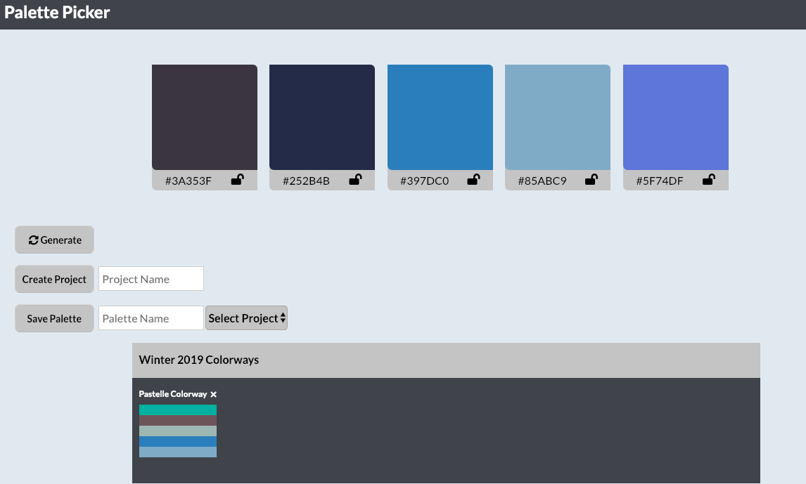

 ## Background 

  For this project I was able to build a full stack application using Node.js for the backend and jQuery for the frontend. Users are able to generate new palettes, but if they like a particular color the user can lock that color, and then generate new colors until they find their perfect palette. The user can then create a project and then store palettes to that project. The data being stored to the server.

## Tech Stack

- HTML/CSS
- jQuery
- Node.js
- Express
- Knex

## Application
#### Link
[Palette Picker is Live on Heroku](https://portillo-palette-picker.herokuapp.com/)

